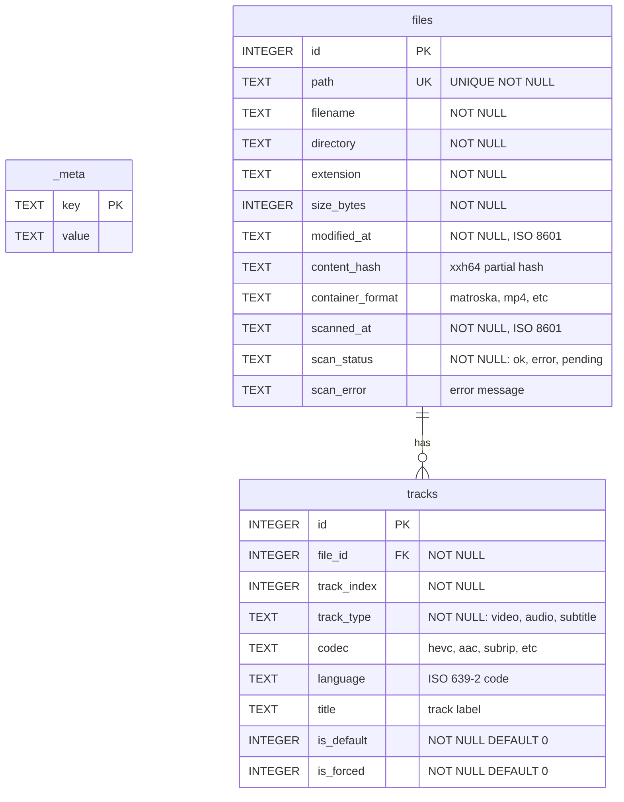
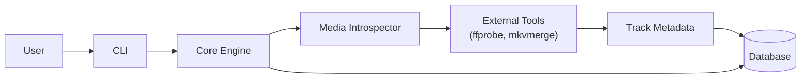
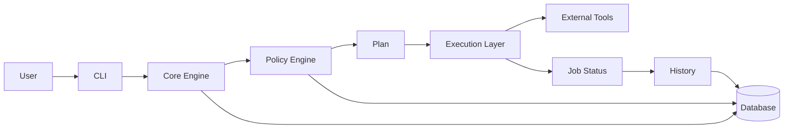

# Database Design

**Purpose:**
This document describes the database schema, access patterns, and design decisions for VPO's SQLite database.
Use this when modifying the schema, adding queries, or understanding data relationships.

---

## Overview

VPO uses SQLite for all persistent storage. The database is located at `~/.vpo/library.db` by default and stores:
- Scanned file metadata
- Track information
- Schema versioning metadata

---

## ER Diagram



---

## Table Descriptions

### `_meta`

Key-value store for database metadata:
- `schema_version`: Current schema version number
- Other configuration or state as needed

### `files`

Stores one row per scanned media file:

| Column | Type | Constraints | Description |
|--------|------|-------------|-------------|
| `id` | INTEGER | PK, AUTOINCREMENT | Unique file identifier |
| `path` | TEXT | UNIQUE, NOT NULL | Absolute file path |
| `filename` | TEXT | NOT NULL | Base filename |
| `directory` | TEXT | NOT NULL | Parent directory |
| `extension` | TEXT | NOT NULL | File extension |
| `size_bytes` | INTEGER | NOT NULL | File size |
| `modified_at` | TEXT | NOT NULL | File modification time (ISO 8601 UTC) |
| `content_hash` | TEXT | | Partial content hash |
| `container_format` | TEXT | | Container type |
| `scanned_at` | TEXT | NOT NULL | Last scan time (ISO 8601 UTC) |
| `scan_status` | TEXT | NOT NULL | Scan result status |
| `scan_error` | TEXT | | Error message on failure |

### `tracks`

Stores one row per track within a file:

| Column | Type | Constraints | Description |
|--------|------|-------------|-------------|
| `id` | INTEGER | PK, AUTOINCREMENT | Unique track identifier |
| `file_id` | INTEGER | FK, NOT NULL | Reference to parent file |
| `track_index` | INTEGER | NOT NULL | Track position in container |
| `track_type` | TEXT | NOT NULL | Track type (video/audio/subtitle) |
| `codec` | TEXT | | Codec identifier |
| `language` | TEXT | | ISO 639-2 language code |
| `title` | TEXT | | Track label |
| `is_default` | INTEGER | NOT NULL, DEFAULT 0 | Default flag (0/1) |
| `is_forced` | INTEGER | NOT NULL, DEFAULT 0 | Forced flag (0/1) |

---

## Indexes

```sql
CREATE UNIQUE INDEX idx_files_path ON files(path);
CREATE INDEX idx_files_directory ON files(directory);
CREATE INDEX idx_files_scan_status ON files(scan_status);
CREATE INDEX idx_tracks_file_id ON tracks(file_id);
CREATE INDEX idx_tracks_type ON tracks(track_type);
```

---

## Data Flow

### Scan Operation



1. CLI receives scan command with target directories
2. Core Engine coordinates the scan process
3. Media Introspector invokes external tools (ffprobe, mkvmerge)
4. Track metadata is normalized and stored in the database

### Apply Operation



1. Policy Engine reads current state from database
2. Compares against desired state defined in policy
3. Produces execution plan
4. Execution Layer performs operations
5. Results stored back in database

---

## Common Queries

### Find files needing rescan

```sql
SELECT path FROM files
WHERE scan_status = 'pending'
   OR scan_status = 'error';
```

### Get all tracks for a file

```sql
SELECT * FROM tracks
WHERE file_id = ?
ORDER BY track_index;
```

### Find files by directory

```sql
SELECT * FROM files
WHERE directory = ? OR directory LIKE ? || '/%';
```

### Count tracks by type

```sql
SELECT track_type, COUNT(*) as count
FROM tracks
GROUP BY track_type;
```

---

## Migration Strategy

Schema migrations follow these rules:
1. Each migration has a unique version number
2. Migrations are applied in order
3. The `_meta.schema_version` key tracks current version
4. Backwards-incompatible changes require a new major version

See `specs/002-library-scanner/data-model.md` for the complete schema specification including future-ready tables (operations, policies).

---

## Design Decisions

- **SQLite**: Chosen for simplicity, zero configuration, and portability
- **Timestamps as TEXT**: ISO 8601 format allows sorting and human readability
- **Booleans as INTEGER**: SQLite convention (0=false, 1=true)
- **CASCADE DELETE**: Tracks are automatically deleted when parent file is removed

---

## Related docs

- [Design Docs Index](DESIGN_INDEX.md)
- [Data Model](../overview/data-model.md)
- [Architecture Overview](../overview/architecture.md)
- [Documentation Index](../INDEX.md)
