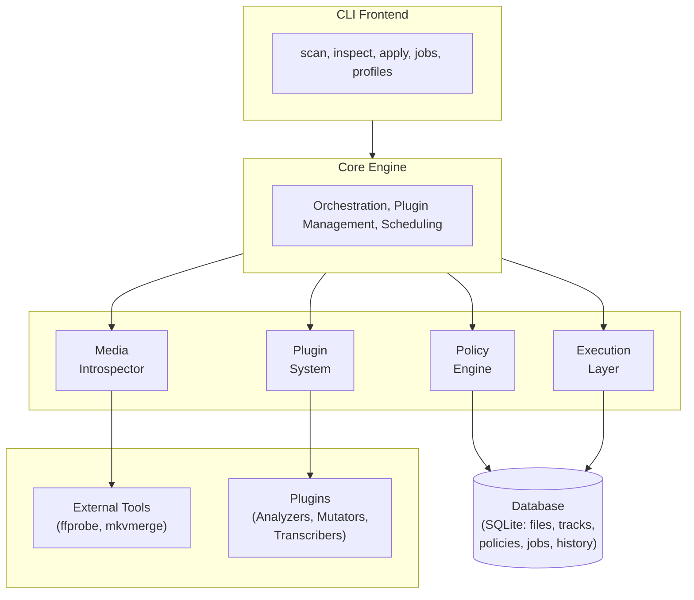
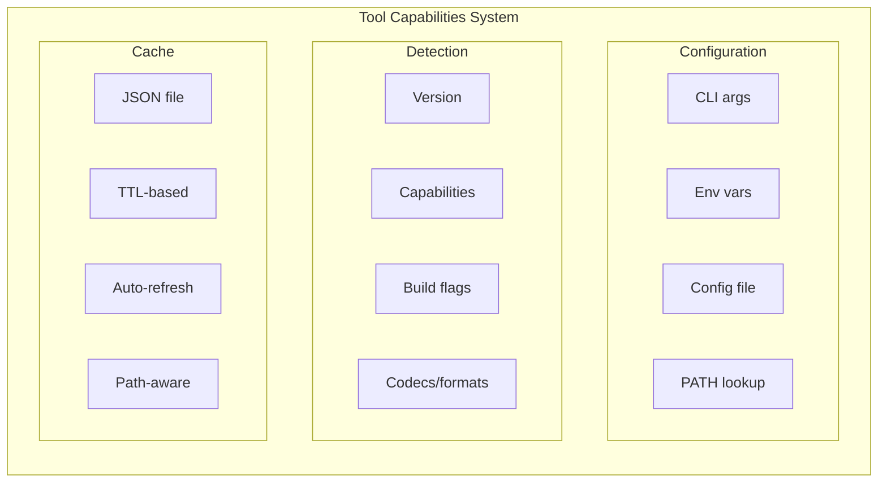

# Architecture Overview

**Purpose:**
This document describes the high-level architecture of Video Policy Orchestrator (VPO).
It covers the major components, how they interact, and the design principles that guide the system.

---

## Overview

VPO follows a layered architecture with clear separation between user interface, business logic, external tool integration, and data persistence. The design prioritizes extensibility through a plugin system while keeping the core minimal.

---

## Component Diagram



---

## Component Descriptions

### CLI Frontend

The user-facing command-line interface providing:
- **scan**: Discover and catalog video files in directories
- **inspect**: View file/track details and current state
- **apply**: Execute policies against the library
- **jobs**: View and manage long-running operations
- **profiles**: Manage policy configurations

Output modes: human-friendly (default) and machine-readable (JSON).

### Core Engine

The central orchestration layer that:
- Coordinates scanning, policy evaluation, and job scheduling
- Manages plugin lifecycle (discovery, loading, execution)
- Exposes stable internal interfaces for plugins
- Handles configuration and logging

### Media Introspector

Abstracts external media tools into a uniform data model:
- Wraps `ffprobe` for general container/codec inspection
- Wraps `mkvmerge`/`mkvpropedit` for MKV-specific operations
- Normalizes track metadata into internal representations
- Handles errors and tool availability detection

### Tool Capabilities

Manages external tool detection and capability tracking:
- **Detection**: Locates tools via configured paths or system PATH
- **Version Parsing**: Extracts version info for compatibility checks
- **Capability Enumeration**: Detects ffmpeg codecs, formats, filters
- **Caching**: Stores detection results in `~/.vpo/tool-capabilities.json`
- **Requirements**: Defines minimum versions for VPO features

See [External Tools Guide](../usage/external-tools.md) for configuration details.

### Policy Engine

Processes user-defined policies:
- Reads policy files (YAML/JSON format)
- Compares current state against desired state
- Produces an execution **plan**: an abstract description of changes
- Supports dry-run mode for preview without modification

#### Policy Schema Evolution

The policy schema has evolved through multiple versions:
- **V3-V5**: Track filtering, audio synthesis, container conversion
- **V6-V8**: Video/audio transcoding with skip conditions, quality settings
- **V9-V10**: Fixed workflow phases (ANALYZE → APPLY → TRANSCODE)
- **V11**: User-defined processing phases
- **V13**: Conditional phases, plugin metadata conditions, enhanced operators (current)

#### V13 User-Defined Phases

V13 supports customizable processing phases, allowing users to:
- Define multiple named phases with arbitrary operations
- Control the order of phase execution
- Configure error handling per-policy
- Conditionally skip phases based on file characteristics

```yaml
schema_version: 13
config:
  on_error: skip
phases:
  - name: cleanup
    audio_filter: { languages: [eng] }
  - name: optimize
    transcode: { target_codec: hevc }
```

**Canonical Operation Order** (within each phase):
1. container, 2. audio_filter, 3. subtitle_filter, 4. attachment_filter,
5. track_order, 6. default_flags, 7. conditional, 8. audio_synthesis,
9. transcode, 10. transcription

See [Policy Editor Guide](../usage/policy-editor.md) for GUI-based policy editing.

### Execution Layer

Performs actual file operations:
- Metadata edits (flags, language codes, titles)
- Container remuxing (track reordering)
- Transcoding (codec conversion, quality adjustment)
- File moves and renames

Integrates with the job queue for long-running operations.

### Plugin System

Extensibility framework supporting:
- **Analyzer plugins**: Add metadata, perform checks, tag content
- **Mutator plugins**: Modify containers, rewrite metadata
- **Transcription plugins**: Speech-to-text, language detection

Plugin discovery via:
- Configurable plugin directories
- Python entry points for packaged plugins

### Database

SQLite-based persistence for:
- **Files**: Path, hash, container info, last scanned
- **Tracks**: Type, codec, language, flags, ordering
- **Policies**: Definitions, versions, application history
- **Jobs**: Status, progress, error logs
- **History**: Audit trail of all operations

See [design-database.md](../design/design-database.md) for schema details.

---

## External Dependencies

| Dependency | Purpose | Required |
|------------|---------|----------|
| ffmpeg/ffprobe | Container inspection, transcoding | Yes |
| mkvmerge/mkvpropedit | MKV container manipulation | Yes (for MKV) |
| SQLite | Data persistence | Yes (bundled with Python) |
| Whisper (optional) | Audio transcription | No (plugin) |

### Tool Management

VPO includes a comprehensive tool management system:



Use `vpo doctor` to check tool health:
```bash
vpo doctor --verbose  # Full capability report
```

See [External Tools Guide](../usage/external-tools.md) for details.

---

## Design Principles

1. **Library-First**: Core functionality as importable library, CLI as thin wrapper
2. **Plugin-Centric**: Specialized behavior in plugins, core stays minimal
3. **Safety-First**: Dry-run by default, no destructive operations without confirmation
4. **Idempotent**: Running the same policy twice produces the same result
5. **Observable**: All operations logged and queryable via database

---

## Future Considerations

- Alternative database backends (PostgreSQL for multi-user)
- Container image distribution

---

## Related docs

- [Documentation Index](../INDEX.md)
- [Project Overview](project-overview.md)
- [Data Model](data-model.md)
- [Database Design](../design/design-database.md)
